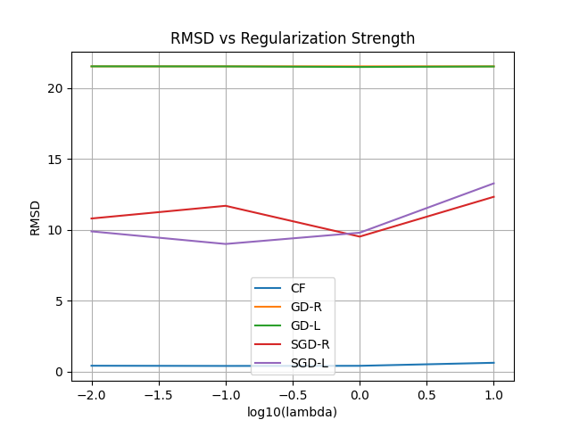

# regularization-on-energy-efficiency
# Regularization on Energy Efficiency Prediction

This project investigates various regularization techniques applied to linear regression for predicting heating load in buildings, based on design features. The goal is to explore how different training strategies and regularization types affect model generalization, overfitting, and feature selection.

### RMSD vs Regularization Plot

---

## Discussion

- **Lasso regularization (GD-L and SGD-L) promotes sparsity**, meaning it pushes many feature weights to exactly zero.
- For low λ (0.01), Lasso retains more non-zero weights, but as λ increases, it prunes features aggressively—highlighting only the most influential ones.
- In contrast, Ridge (L2) regularization shrinks weights but **rarely makes them exactly zero**, resulting in models that use **all features**, just more conservatively.

### Real-World Interpretation

In the context of energy efficiency in buildings, Lasso-based methods help identify the most important design features impacting energy consumption. This kind of feature selection is not only computationally efficient but also helps architects and engineers focus on the key design parameters when planning energy-efficient buildings.